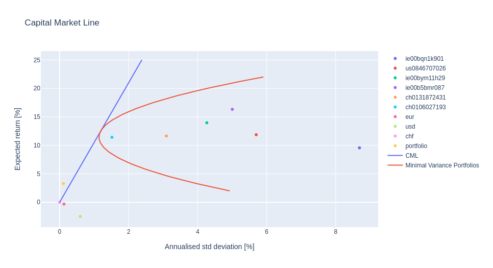
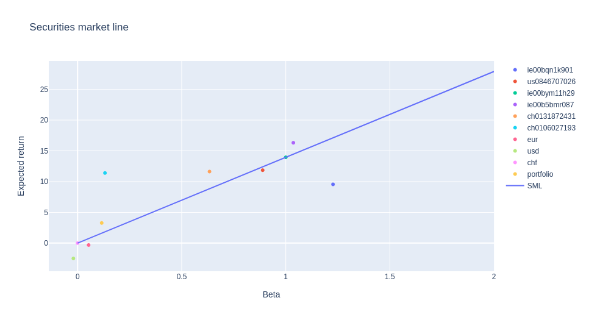

# CAPM

Repo to visualise instruments and portfolios in the language of CAPM. 
For an example of how to use it see `src/plots.ipynb`. 

### Structure

```
data                            # Not under VC. create your own.
  - acc_<name1>.csv             # Accounts in different currencies
  - acc_<name2>.csv
  - ...
  - cur_<name3>.csv             # Currency values
  - cur_<name4>.csv
  - ...
  - pos_<isin1>_<expl1>.csv     # Position (in number of shares) of isin numbers
  - ...
  - val_<isin1>_<expl1>.csv     # Value (of a share) of isin numbers
src
  - accounts.py                 # Allows summing all account files by currency
  - all_exposure.py             # Allows collecting the positions and returns their value in a reference currency
  - all_values.py               # Allows getting valuations of currencies and instruments
  - capm.py                     # Calculates minimum variance portfolios for given returns
  - currencies.py               # Allows reading all the currency files
  - isin.py                     # Utility for combining positions and valuations
  - isin_positions.py           # Utility for reading the position changes by isin
  - performance.py              # Allows calculating portfolio performance
  - utilities.py                # General utilities
```

The data are expected in the following format:

#### Accounts

```
date,eur
01.04.2021,10000
```

Note that it is sufficient to have rows for when the value changes 
(important for rarely used accounts). 
Constant value until the next entry is assumed in that case.

#### Currencies

```
# _cur_eurchf
Date, Open, High, Low, Close
03/26/21, 1.10xx, 1.10xx, 1.10xx, 1.10xx
```

Notation is that an amount in the first currency must me multiplied by the number in the file to get
the amount in the second currency. 
This is different from the standard notation used in the CFA curriculum (reciprocal), but this is how
the source I used delivered it.
Also note the unfortunate date notation, but again, the source dictades what is available.

#### Positions

```
date,CH01XXXXXXXX
25.3.2020,100
```

Same principle and format as the account data.
Entries are only needed when the position changes.


#### Values

```
Date,Open,High,Low,Close,Volume,
26.03.2021,252.5,257.39,252.5,256.77,1615653,
```

or

```
Date,NAV,Open,High,Low,Total return,Volume,
23.03.2021,6.3852,,,,6.3852,,
```

In the first case, close is taken, in the second, Total return is used.


### Output

The output of `plots.ipynb` are the standard CML and SML plots.




